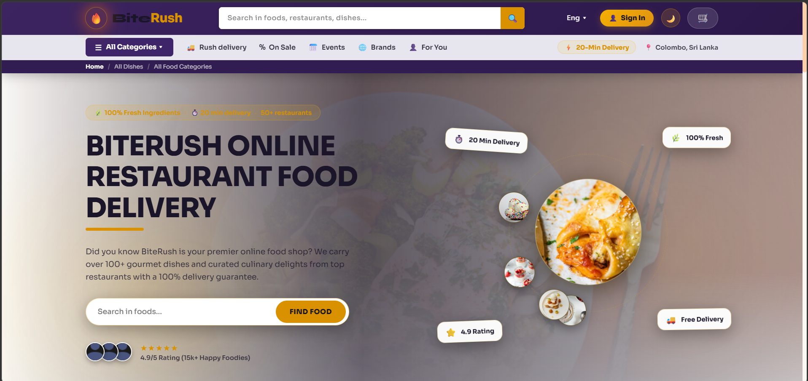
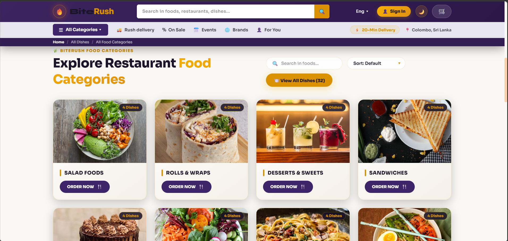
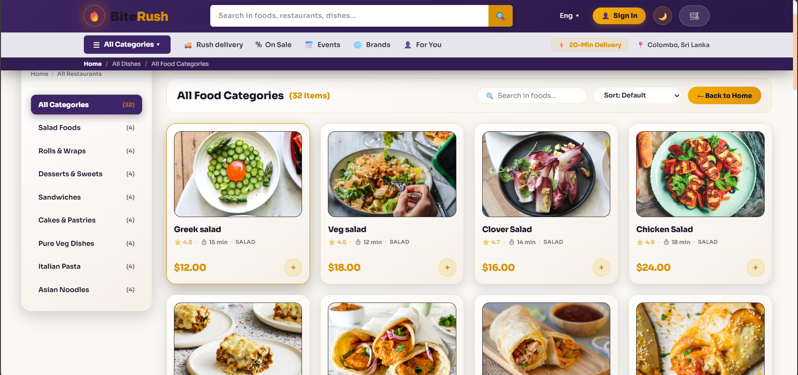
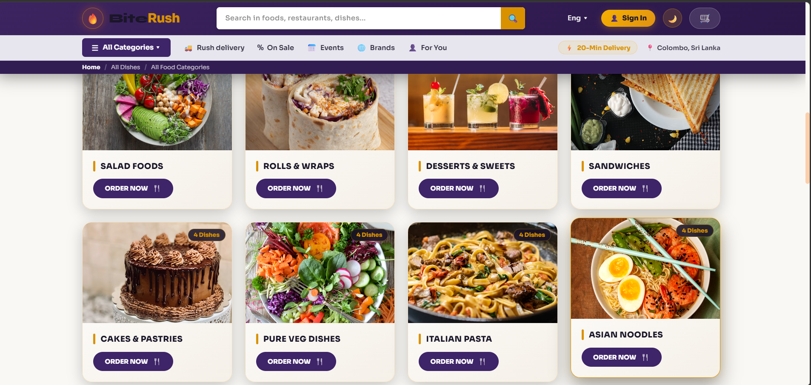

# 🍔 BiteRush — Online Food Delivery Platform

BiteRush is a full-stack MERN (MongoDB, Express, React, Node.js) food delivery application. It lets customers browse restaurants and dishes, add items to their cart, and place orders, while restaurant admins manage the food catalog and incoming orders through a dedicated admin dashboard.

**Repository:** [https://github.com/DimuthuMadhawa/biterush-food-delivery.git](https://github.com/DimuthuMadhawa/biterush-food-delivery.git)

---

## 📸 Screenshots

### Home Page


### Food Categories


### All Dishes / Items


### Category View


---

## ✨ Features

- 🔍 Search and browse foods, restaurants, and dishes
- 🗂️ Category-based food browsing (Salads, Rolls & Wraps, Desserts, Sandwiches, Pasta, Noodles, and more)
- 🛒 Shopping cart and checkout flow
- 👤 User authentication (sign up / login) and profile/dashboard
- 📦 Order placement and order tracking
- 🛠️ Admin panel to add/list food items and manage orders
- 🐳 Dockerized setup for backend, frontend, admin panel, and MongoDB

---

## 🏗️ Tech Stack

| Layer      | Technology |
|------------|------------|
| Frontend   | React 19, Vite, React Router, Axios, Lucide Icons |
| Admin Panel| React 19, Vite |
| Backend    | Node.js, Express 5, MongoDB (Mongoose), JWT, bcrypt, Multer |
| Deployment | Docker & Docker Compose |

---

## 📁 Project Structure

```
food delivery/
├── frontend/     # Customer-facing React app (Home, Cart, Checkout, Profile, etc.)
├── admin/        # Admin dashboard (Dashboard, Add Food, List, Orders, Login)
├── backend/      # Express REST API (food, order, user routes & models)
├── screenshot/   # App screenshots used in this README
└── docker-compose.yml
```

---

## 🚀 Getting Started

### Prerequisites
- Node.js (v18+ recommended)
- MongoDB (local or Atlas), or Docker

### Option 1: Run with Docker (recommended)
```bash
git clone https://github.com/DimuthuMadhawa/biterush-food-delivery.git
cd biterush-food-delivery
docker compose up --build
```
This spins up:
- Backend → `http://localhost:4000`
- Frontend → `http://localhost:5173`
- Admin panel → `http://localhost:5174`
- MongoDB → `localhost:27017`

### Option 2: Run manually

**Backend**
```bash
cd backend
npm install
```
Create a `.env` file in `backend/` with:
```
PORT=4000
MONGODB_URI=<your-mongodb-connection-string>
```
Then start the server:
```bash
npm run server
```

**Frontend**
```bash
cd frontend
npm install
npm run dev
```

**Admin Panel**
```bash
cd admin
npm install
npm run dev
```

---

## 📝 License

This project is open source. Feel free to fork and build on it.
